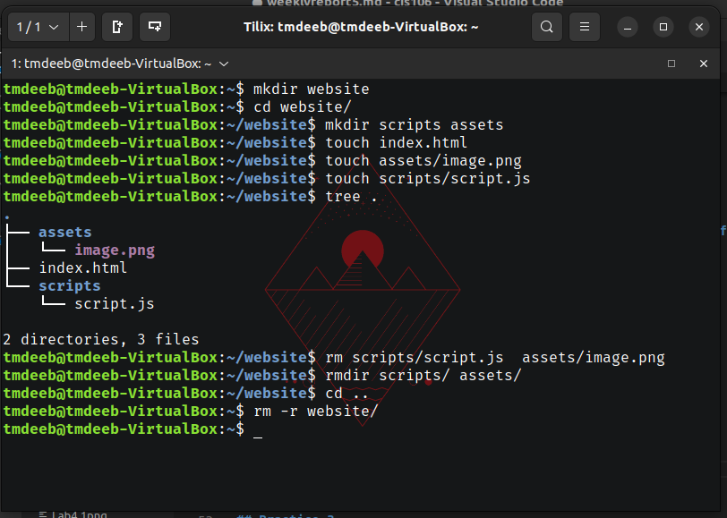
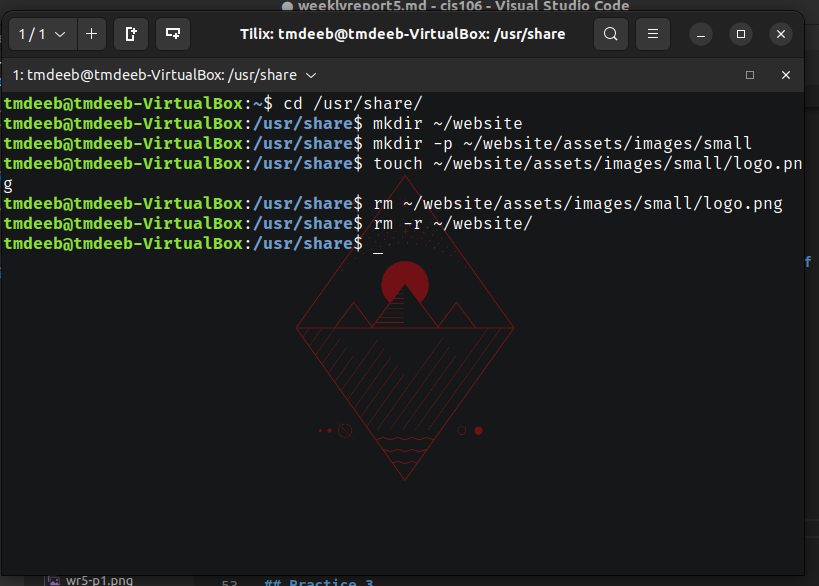
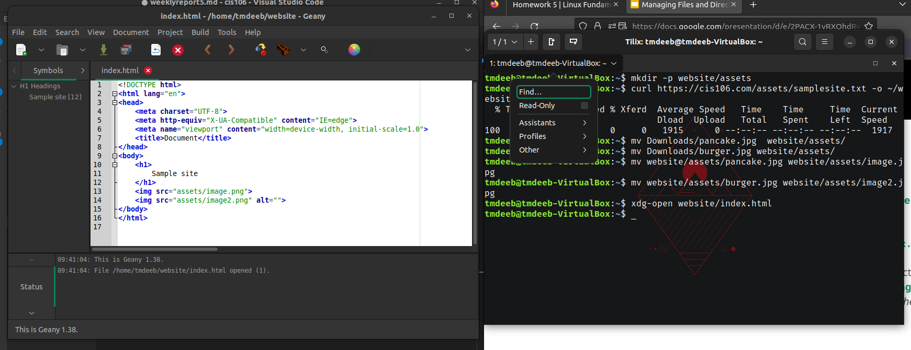
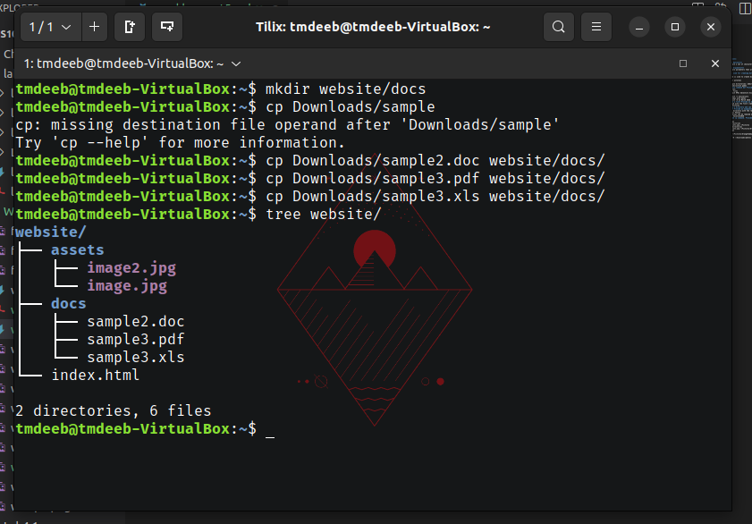

# Week Report 5

## Answers for questions:

* **What are Command Options?**
    Command options are a set of characters or words that follow a command.
* **What are Command Arguments?**
  Command Arguments are parameters that are given on the system command line.
* **Which command is used for creating directories? Provide at least 3 examples.**
    The mkdir command is used to create directories.
    * example 1:
      * Create: mkdir potatoes
    * example 2:
      * Create multiple directories: mkdir games ~/Downloads/puzzle games ~/Downloads/action games
* **What does the touch command do? Provide at least 3 examples.**
  The touch command can:
   * create multiple files
     * example 1: touch RPGs Adventure Sci-Fi
   * set timestamp
     * example 2: touch -t Anniversary
   * set file timestamps with dates
     * example 3: touch -d 22 March 2018
* **How do you remove a file? Provide an example.**
    Use the rm command with the file's name.
    * example 1: rm Pictures
* **How do you remove a directory and can you remove non-empty directories in Linux? Provide an example**
    You can remove a directory with the rmdir command.
    * example 1: rmdir Photos
    Non-empty directories can be removed with the rm -r command.
    example 2: rm -r Vacation2020
* **Explain the mv and cp command. Provide at least 2 examples of each**
    The mv command can
    move files or directories
    * example 1: mv cat1.png ~/Pictures
    rename files or directories
    * example 2: mv cat2.png ~/Pictures/OrangeTabby.png
    The cp command can
    copy a file
    * example 1: cp ~/Pictures/OrangeTabby.png ~/Pictures/cats
    copy a directory
    * example 2: cp -R ~/Downloads/photos ~/Pics/

## Practice 1

## Practice 2

## Practice 3

## Practice 4
