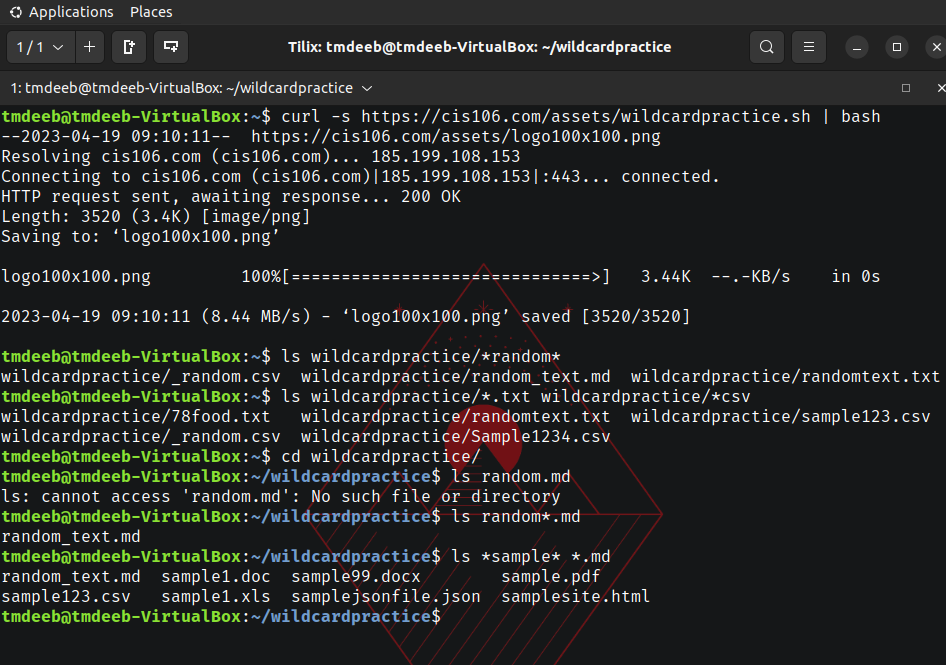
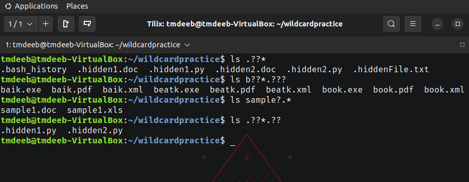
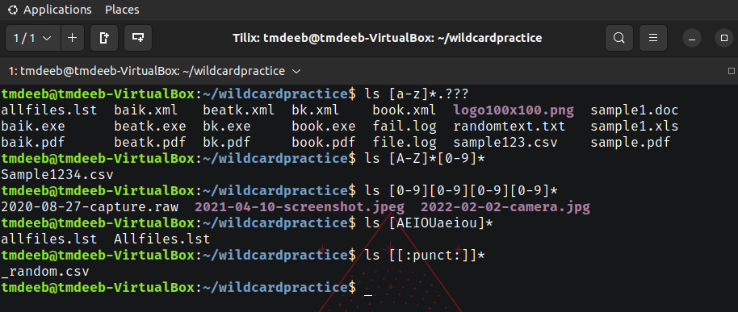

# Weekly report 6

## Wildcards

### * Wildcard
The main wildcard is a star or asterisk character.
* Examples:
  * List all files that end in .txt
    * `ls *.txt`
  * List all files that start with the string "file" regardless of extension.
    * `ls file.*`
  * Lists all files that have any letter before the string "file" and after as well.
    * `*file.*`

### ? Wildcard
The ? wildcard matches only one character.
* Examples:
  * List all the hidden files in the current directory
    * `./.??*`
  * List all the hidden files in parent directory
    * `ls ../.??*`
  * List all the files that have a 3 letter file extension.
    * `ls *.???`
### [] Wildcard
Brackets match a single character in a range.
* Examples:
  * Match all files that have vowel after f
    * `ls f[aeiou]*`
  * Match all files which start with a number.
    * `ls [0-9]*`
  * March all files that begin with a letter a-p or start with p-z.
    * `ls [a-fp-z]*`
### Brace Expansion

## Practice

