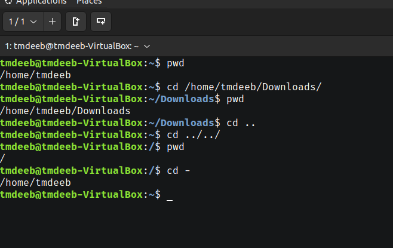
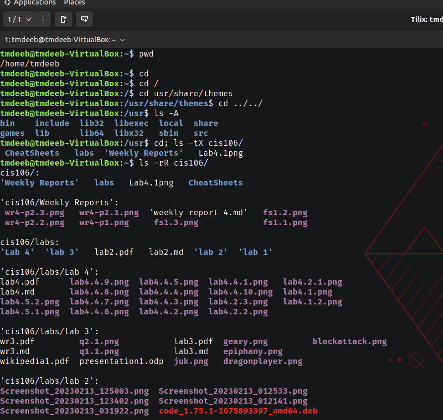
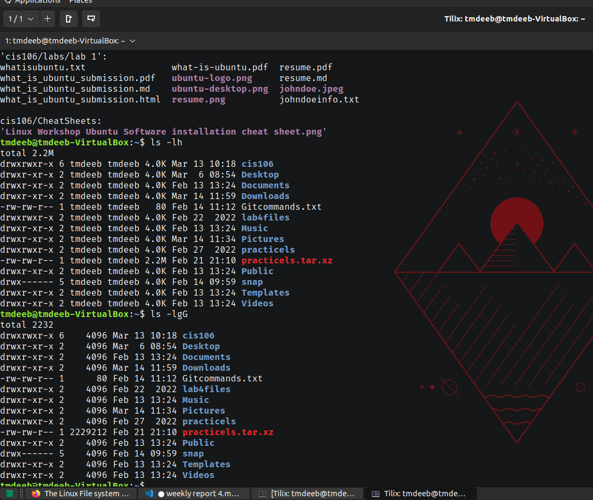

# weekly Report 4

## Practice from the presentation The Linux File system:
### practice 1:

### practice 2:

### practice 3:

## The Linux File system directories and their purpose:

## All the commands for navigating the filesystem

| Command | What it does                         | Syntax | Example                      |
| ------- | ------------------------------------ | ------ | ---------------------------- |
| pwd     | prints current directory             | pwd    | `pwd`                        |
| cd      | changes current directory            | cd     | `cd /Downloads/`             |
| ls      | makes a list of files in a directory | ls     | `ls /home/tmdeeb/Downloads/` |

## Basic terminology 
* **File system: The way files are stored and organized**
* **Current directory: The directory where you are at the moment**
* **parent directory: A directory and you can move forward to asubdirectory or backwards to the previous directory**
* **the difference between your home directory and the home: Your home directory is personal but the home directory is the default**
* **pathname: It shows the location of your file in the system**
* **relative path: The location of a file starting from the current working directory ot directory that is located inside the current working directory**
* **absolute path: The location of a file starting a the root of the file system**

